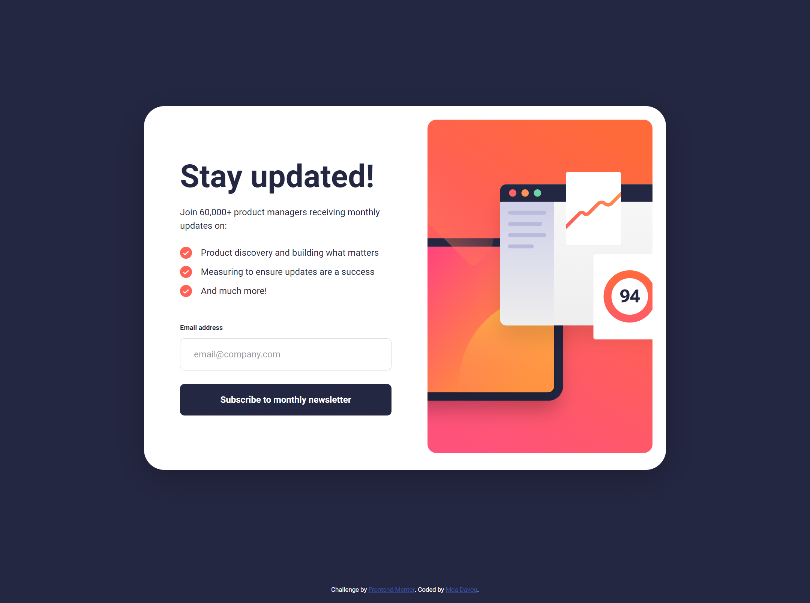

# Frontend Mentor - Newsletter sign-up form with success message solution

This is a solution to the [Newsletter sign-up form with success message challenge on Frontend Mentor](https://www.frontendmentor.io/challenges/newsletter-signup-form-with-success-message-3FC1AZbNrv). Frontend Mentor challenges help you improve your coding skills by building realistic projects.

## Table of contents

- [Overview](#overview)
  - [The challenge](#the-challenge)
  - [Screenshot](#screenshot)
  - [Links](#links)
- [Setup & Usage](#setup--usage)
- [My process](#my-process)
  - [Built with](#built-with)
  - [What I learned](#what-i-learned)
  - [Continued development](#continued-development)
- [Author](#author)

## Overview

### The challenge

Users should be able to:

- Add their email and submit the form
- See a success message with their email after successfully submitting the form
- See form validation messages if:
  - The field is left empty
  - The email address is not formatted correctly
- View the optimal layout for the interface depending on their device's screen size
- See hover and focus states for all interactive elements on the page

### Screenshot

### Links

- Repository URL: [GitHub](https://github.com/moadavou/newsletter-sign-up-with-success-message)
- Live Site URL: [GitHub Pages](https://moadavou.github.io/newsletter-sign-up-with-success-message/)

## Setup & Usage

After you clone this repo to your desktop, go to its root directory and run `npm install` to install its dependencies.

Once the dependencies have been installed, you can run `npm start` to access the website's live server in your browser. You will then be able to access it at [localhost:3000](http://localhost:3000).

When the project is ready for deployment, run `npm run build` to compile the scss and sass files to css, minimize, autoprefix, and purge unwanted classes.

### Available Scripts

| Script           | Effect                                                                                             |
| ---------------- | -------------------------------------------------------------------------------------------------- |
| **sass:build**   | Compiles SASS files.                                                                               |
| **sass:watch**   | Watches SASS files for changes and compiles them.                                                  |
| **server**       | Starts a development server with BrowserSync.                                                      |
| **start**        | Watches SASS files for changes and compiles them and starts a development server with BrowserSync. |
| **purgecss**     | Removes unused CSS based on HTML and JS content.                                                   |
| **postcss**      | Applies Autoprefixer and CSSNano optimizations to CSS files.                                       |
| **build**        | Runs a complete build process including SASS compilation, CSS purging, and optimization.           |
| **lint**         | Checks the codebase for linting issues using ESLint.                                               |
| **lint:fix**     | Fixes linting issues where possible using ESLint.                                                  |
| **prettier**     | Checks for formatting issues using Prettier.                                                       |
| **prettier:fix** | Fixes formatting issues using Prettier.                                                            |
| **format**       | A complete codebase format and lint fix using Prettier and ESLint.                                 |

## My process

### Built with

- Semantic HTML5 markup
- CSS custom properties
- Flexbox
- CSS Grid
- Mobile-first workflow

* [CUBE CSS](https://cube.fyi/) - CSS methodology
* [Sass](https://sass-lang.com/) _(v1.77.2)_ - CSS pre-processor

### What I learned

This was my first time creating a form from scratch. I learned a lot, including how to create and validate forms, basic form managing in JavaScript, and ARIA attributes that can be good to use with forms.

At first, I tried to create the success message using a simple `
` and `position: absolute`. But then I remembered the `<dialog>` element. This approach made me write less code due to the functions, included in the `<dialog>` element. It also made managing the success message easier.

I learned that I can use `aria-describedby` to get screen readers to read error messages and that I need to use `aria-required` for required form fields.

### Continued development

I have to work more with forms to become more comfortable with them. I had to look up a lot since I'm still very new to them and JavaScript. Writing the code is a slow process, and it requires a lot of information lookup. However, I'm getting better each day.

## Author

- Frontend Mentor - [@moadavou](https://www.frontendmentor.io/profile/moadavou)
- LinkedIn - [@moadavou](https://www.linkedin.com/in/moadavou/)
